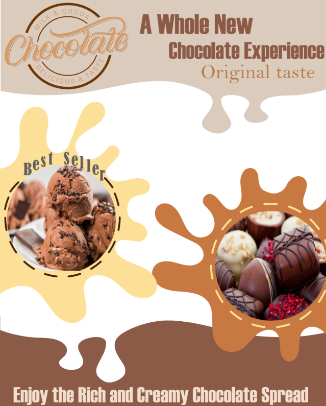

# 🎨 Adobe Illustrator Designs — Level 1

A collection of graphic design works created using Adobe Illustrator 
as part of my Level 1 training at Majestic Training Center.

## ⭐ Final Project

**Chocolate** — Final project for the course. A marketing flyer 
designed independently from scratch for a chocolate brand.

## 📁 Other Works

**Exclusive Offer** — Promotional design for Cookies House

**Buy & Get** — Voucher card design for Finixa

**Perfume** — Promotional design

## 🛠️ Tools Used
- Adobe Illustrator

## 👩‍🎨 Designer
Manar Noori — [Portfolio](https://meem19.github.io/portfolio)
